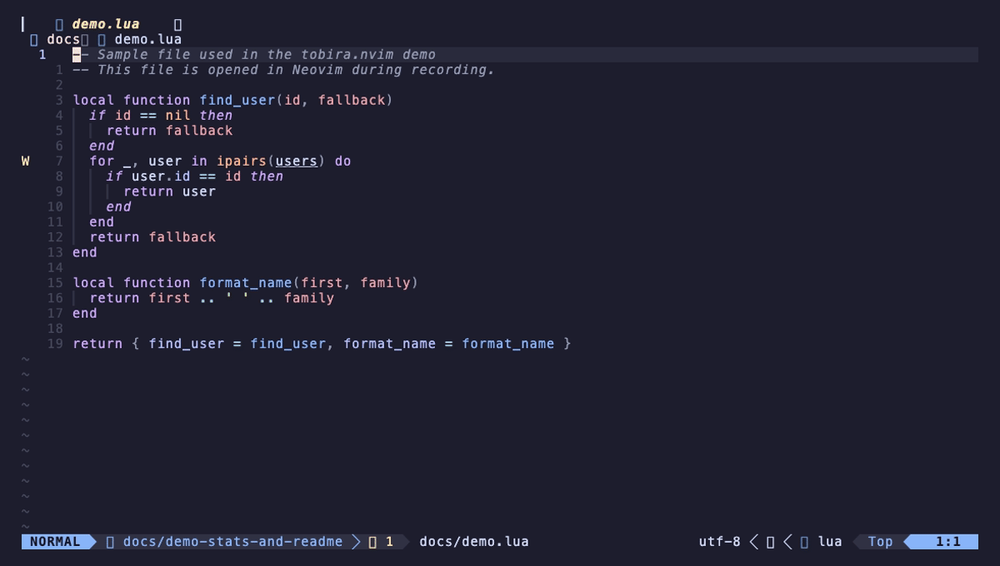

# tobira.nvim

> Open the next door in your Vim journey.

**tobira** (扉) means "door" in Japanese.

<p align="center">
  
</p>

Once you're comfortable with Vim, you stop actively learning new commands — you just use the ones you already know. tobira watches how you actually work, and when it notices you're doing something the hard way, it quietly shows you the better path.

No generic tip lists. No quizzes. Just _your_ habits, and the one command that would've helped you just now.

---

## How it works

```
You press f  →  then f  again on the same line
                          ↓
              tobira notices the repeated search
                          ↓  (1.5 seconds later)

  ╭─ tobira / ; — repeat the last f ──────── ℹ ─╮
  │ After f{char}, press ; to jump to the next   │
  │ occurrence. , goes in the reverse direction. │
  │                                              │
  │ e.g. fx;;                                    │
  ╰──────────────────────────────────────────────╯
```

Suggestions appear as notifications (compatible with [nvim-notify](https://github.com/rcarriga/nvim-notify) — no dependency required).

- Waits for a natural pause before showing — never interrupts your flow
- Shows at most **once per session**
- If you start using the suggested command → **learned**, never shown again
- Shown 3 times with no adoption → **suppressed**, moves on to the next suggestion

---

## Guide panel

On first launch, tobira shows a cheatsheet on the right side of the screen for new users:

```
  ╭──────── ℹ tobira guide ────────╮
  │                                │
  │  移動                          │
  │  h j k l   カーソル移動        │
  │  w / b     単語単位で移動      │
  │  0 / $     行頭 / 行末         │
  │  gg / G    ファイル先頭 / 末尾 │
  │  f{char}   文字へジャンプ      │
  │                                │
  │  編集                          │
  │  i         インサートモード    │
  │  Esc       ノーマルモードへ戻る│
  │  dd        行を削除            │
  │  yy / p    コピー / 貼り付け  │
  │  u / <C-r> undo / redo        │
  │                                │
  │  ファイル                      │
  │  :w        保存                │
  │  :q        終了                │
  │  :wq       保存して終了        │
  │                                │
  │  検索                          │
  │  /{text}   検索                │
  │  n / N     次 / 前の結果       │
  │                                │
  │  :TobiraGuide  ガイドを閉じる  │
  ╰────────────────────────────────╯
```

- Shown automatically on first launch only
- Stays behind other windows — never interrupts your workflow
- `:TobiraGuide` to open / close at any time

---

## Detected patterns

| You do this | tobira suggests |
|---|---|
| `fa` → `fa` on the same line | `;` (repeat last f) |
| `dw` → `i` (delete then insert) | `cw` / `ciw` |
| `x` × 3 in a row | `{n}x` (count prefix) |
| `u` × 3 in a row | `<C-r>` (redo) |
| `dd` → `p` | `ddp` (swap lines) |
| `j` × 5 in a row | `{n}j` / `<C-d>` |
| `0` → `w` | `^` (first non-blank) |
| `n` × 3 after search | `cgn` (change next match) |

---

## Installation

**lazy.nvim**
```lua
{
  "kamegoro/tobira.nvim",
  event = "VeryLazy",
  opts = {},
}
```

**packer.nvim**
```lua
use {
  "kamegoro/tobira.nvim",
  config = function()
    require("tobira").setup()
  end,
}
```

---

## Configuration

```lua
require("tobira").setup({
  idle_delay  = 1500,  -- ms to wait after detecting a pattern (default: 1500)
  max_shown   = 3,     -- suppress after showing N times without adoption (default: 3)
  lang        = 'en',  -- guide panel language: 'en' | 'ja' (default: 'en')
})
```

---

## Commands

| Command | Description |
|---|---|
| `:Tobira` | Show the next suggestion now |
| `:TobiraGuide` | Toggle the vim cheatsheet panel |
| `:TobiraStats` | Show your command usage statistics |
| `:TobiraReset` | Clear all usage data |
| `:checkhealth tobira` | Verify the plugin is set up correctly |

---

## Requirements

- Neovim 0.9+
- [nvim-notify](https://github.com/rcarriga/nvim-notify) _(optional — suggestions fall back to `vim.notify` without it)_

---

## Similar plugins

| Plugin | What it does | vs tobira |
|---|---|---|
| [pathfinder.vim](https://github.com/AlphaMycelium/pathfinder.vim) | Suggests more efficient cursor movement | Cursor movement only |
| [vim-be-good](https://github.com/ThePrimeagen/vim-be-good) | Game-based practice | Generic drills, not personalized |

tobira is the only plugin that learns from **your actual usage** and surfaces the specific commands _you_ are missing — not a generic curriculum.

---

## Contributing

See [CONTRIBUTING.md](./CONTRIBUTING.md). This project follows strict TDD — tests are written before implementation.

## License

MIT
