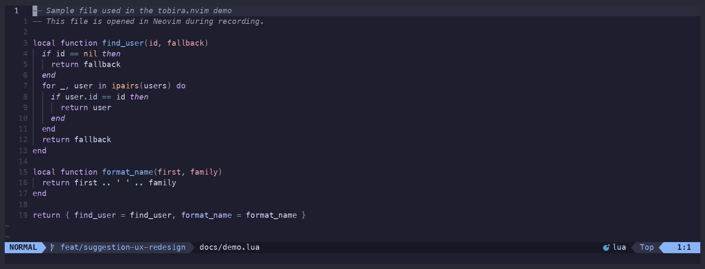
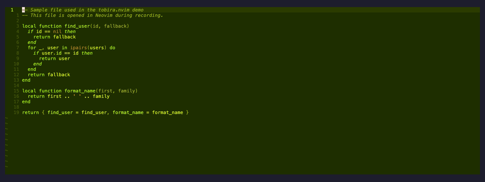
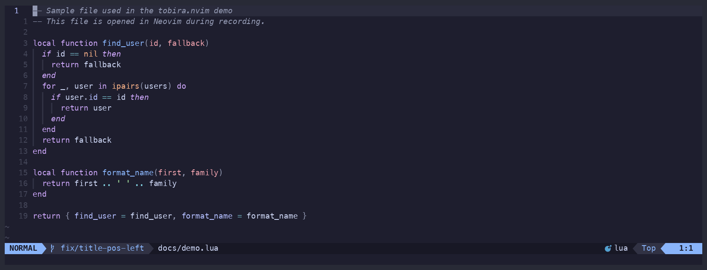

# tobira.nvim

<p align="center">
  <a href="https://github.com/kamegoro/tobira.nvim/actions/workflows/ci.yml"></a>
  <a href="https://github.com/kamegoro/tobira.nvim/actions/workflows/ci.yml"></a>
  <a href="https://github.com/neovim/neovim/releases/tag/v0.9.0"></a>
  <a href="./LICENSE"></a>
  <a href="https://github.com/kamegoro/tobira.nvim/stargazers"></a>
</p>

<p align="center"><b>Open the next door in your Vim journey.</b></p>

<p align="center">
  tobira watches how you actually edit.<br>
  When it spots a pattern you could do better, it quietly shows you the one command that would have helped — right now, not someday.
</p>

<p align="center">
  
</p>

No quizzes. No interruptions. Just your habits, and the better path.

---

## ✨ How it works

- **Watches your keystrokes passively** — no config required, zero impact on your mappings
- **Detects inefficient patterns** — repeated `f`, hammering `j`, `dw`→`i` instead of `cw`, and more
- **Suggests the one better command** — shown after a natural pause, up to `max_shown` times per session, with a cooldown between auto-suggestions
- **Tracks mastery by watching your behavior** — once you've used a command ~100 times, tobira stops suggesting it
- **Filters to your level** — beginner commands first, advanced ones once you're ready
- **136 commands in the learning graph** — motion, edit, search, window, fold, mark, and macro commands from the full Neovim index

---

## 📺 Guide panel

<p align="center">
  
</p>

`:TobiraGuide` opens a cheatsheet on the right side of the screen. Commands you've mastered show **✓** and reveal the next step with **→**. Covers all 7 categories: motion, edit, search, window, fold, mark, and macro. Shown automatically on first launch.

---

## 📊 Skill progress

<p align="center">
  
</p>

`:TobiraProgress` shows your current level and the full learning graph. Press `x` on any row to suppress a suggestion you don't want; press `x` again to restore it. Press `p` to pin a command so it always appears at the top of `:TobiraGuide`.

---

## 🎯 Detected patterns

| You do this | tobira suggests |
|---|---|
| `fa` → `fa` on the same line | `;` — repeat the last f/t/F/T |
| `dw` → `i` (delete then retype) | `cw` — change word directly |
| `x` × 3 in a row | `{n}x` — count prefix |
| `u` × 3 in a row | `<C-r>` — redo |
| `dd` → `p` | `ddp` — swap lines in one motion |
| `j` × 5 in a row | `{n}j` — count prefix |
| `k` × 5 in a row | `{n}k` — count prefix |
| `0` → `w` | `^` — first non-blank character |
| `n` × 4 after a search | `cgn` — change next match |

---

## ⚡️ Installation

**lazy.nvim**
```lua
{
  "kamegoro/tobira.nvim",
  event = "VeryLazy",
  opts = {},
}
```

**packer.nvim**
```lua
use {
  "kamegoro/tobira.nvim",
  config = function()
    require("tobira").setup()
  end,
}
```

---

## ⚙️ Configuration

All options are optional — the defaults work out of the box.

```lua
require("tobira").setup({
  lang                = 'en',    -- 'en' | 'ja'
  idle_delay          = 1500,    -- ms of inactivity before showing an ambient suggestion
  idle_suggestions    = true,    -- enable ambient idle suggestions
  suggestion_cooldown = 300,     -- s between automatic suggestions (default: 5 min)
  max_shown           = 2,       -- max times to suggest the same command per session
})
```

---

## 🔧 Commands

| Command | Description |
|---|---|
| `:Tobira` | Show the next suggestion now (ignores cooldown) |
| `:TobiraGuide` | Toggle the cheatsheet panel |
| `:TobiraProgress` | Show skill tree with level and mastered commands |
| `:TobiraStats` | Show usage stats: command distribution (never/tried/familiar/mastered) and efficiency gap suggestions |
| `:TobiraReset` | Clear all usage data |

Full documentation is available in Neovim via `:help tobira`.

---

## 🔍 Requirements

- Neovim 0.9+
- [nvim-notify](https://github.com/rcarriga/nvim-notify) _(optional — suggestions fall back to `vim.notify` without it)_

---

## 🆚 Similar plugins

| Plugin | What it does | vs tobira |
|---|---|---|
| [hardtime.nvim](https://github.com/m4xshen/hardtime.nvim) | Blocks repeated keys, hints better motions | _Punishes_ bad habits — tobira teaches without ever blocking input |
| [precognition.nvim](https://github.com/tris203/precognition.nvim) | Shows available motions as virtual text | Always-on overlay — tobira appears only when _you_ would have benefited |
| [spamguard.nvim](https://github.com/timseriakov/spamguard.nvim) | Detects key spamming | Spam detection only — tobira covers the full command graph and tracks mastery |
| [pathfinder.vim](https://github.com/AlphaMycelium/pathfinder.vim) | Suggests more efficient cursor movement | Cursor movement only — tobira covers motion, edit, and search |
| [vim-be-good](https://github.com/ThePrimeagen/vim-be-good) | Game-based practice | Generic drills — tobira personalizes to your actual usage |

tobira is the only plugin that learns from **your actual usage** and shows you the specific commands _you_ are missing.

---

## Contributing

See [CONTRIBUTING.md](./CONTRIBUTING.md). This project follows strict TDD — tests before implementation, always.

## License

MIT
