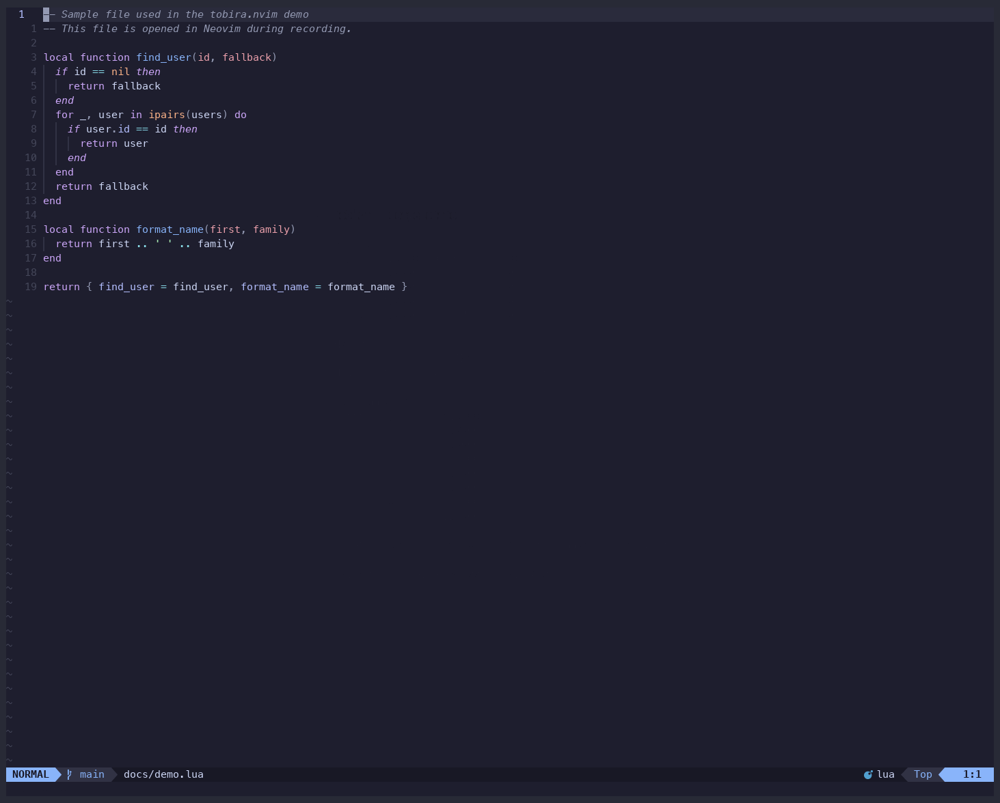

<div align="center">

# 🚪 tobira.nvim

**Learn the next Vim command from your own editing habits — not a cheat sheet.**

tobira watches how you actually edit, and when it spots a pattern you could do better,
it quietly shows you the one command that would have helped. No quizzes. No interruptions.

<a href="https://github.com/kamegoro/tobira.nvim/actions/workflows/ci.yml"></a>
<a href="./LICENSE"></a>
<a href="https://github.com/kamegoro/tobira.nvim/stargazers"></a>
<a href="https://dotfyle.com/plugins/kamegoro/tobira.nvim"></a>

[Features](#-features) • [Installation](#-installation) • [Usage](#-usage) • [Configuration](#-configuration) • [vs hardtime.nvim](#-similar-plugins)


</div>

---

## ✨ Features

- 👀 **Fully passive** — reads keystrokes via `vim.on_key()`; no config required, zero impact on your existing mappings
- 🎯 **34 detected patterns** — repeated `f`, hammering `j`, `dw`→`i` instead of `cw`, and more across motion, edit, search, window, fold, mark, and macro
- 💬 **One suggestion at a time** — shown after a natural pause, capped per session, with a cooldown between auto-suggestions — never a popup quiz
- 📈 **Mastery-aware** — once you've used a command ~100 times, tobira stops suggesting it and moves on
- 🪜 **Level-aware** — beginner commands surface first, advanced ones once you're ready
- 🗺️ **148 commands** in the learning graph, covering the full Neovim command surface

## ⚡️ Requirements

- Neovim 0.9+
- [nvim-notify](https://github.com/rcarriga/nvim-notify) _(optional — if installed, tobira's suggestion window matches its color scheme)_

## 📦 Installation

**lazy.nvim**
```lua
{
  "kamegoro/tobira.nvim",
  event = "VeryLazy",
  opts = {},
}
```

**packer.nvim**
```lua
use {
  "kamegoro/tobira.nvim",
  config = function()
    require("tobira").setup()
  end,
}
```

## 🚀 Usage

| Command | Description |
|---|---|
| `:Tobira` | Show the next suggestion now (ignores cooldown). Press `q` / `Esc` to dismiss. |
| `:TobiraGuide` | Toggle the cheatsheet panel |
| `:TobiraProgress` | Show skill tree with mastery glyphs and a cursor-driven detail preview. `x` = suppress, `p` = pin, `g`/`s` = jump to guide/stats, `q`/`Esc` = close. |
| `:TobiraStats` | Show usage stats: command distribution (never/tried/familiar/mastered) and efficiency gap suggestions |
| `:TobiraReset` | Clear all usage data |
| `:checkhealth tobira` | Diagnose your install — Neovim version, data directory, usage.json validity, `lang` config |

Full documentation is available in Neovim via `:help tobira`.

<details>
<summary><b>📸 Screenshots — Guide, Stats &amp; Progress panels</b></summary>

### Guide panel

<p align="center">
  
</p>

`:TobiraGuide` opens a cheatsheet on the right side of the screen. Commands you've already mastered are automatically hidden, so only your next targets are shown — and if one of them fades from use after you'd gotten comfortable with it, it reappears with a `⟳` (forgotten) marker instead of staying hidden forever. Pinned commands always appear at the top, marked `●`. Covers all 7 categories: motion, edit, search, window, fold, mark, and macro. Opens automatically on first launch.

### Usage stats

<p align="center">
  
</p>

`:TobiraStats` leads with the one section that actually changes what you do next — **Try these next**, commands you're using heavily whose neighbors you've never tried — followed by a mastery bar and your top commands. Total keystrokes and how many commands you've discovered sit in a quiet line at the bottom: fun to see, but not the point. `g` / `p` jump straight to Guide / Progress.

### Skill progress

<p align="center">
  
</p>

`:TobiraProgress` shows your current level and the full command learning graph as a calm grid — mastery glyphs only, no clutter. Move the cursor onto any command and a preview strip below the grid fills in with its usage sparkline, count, status, and how far it is from the next star. The header shows your overall `{n} / {total} mastered` ratio, and each category shows its own `{done} / {total}`.

| Glyph | Meaning |
|---|---|
| _(blank)_ | Not yet tried |
| `☆` | Tried (1+ uses) |
| `★` | Familiar (100+ uses) |
| `★★` | Practiced (1000+ uses) |
| `★★★` | Mastered (5000+ uses) |
| `⟳` | Forgotten — recent use has fallen off well below its earlier pace |
| `✗` | Suppressed — you don't want this suggested |
| `●` | Pinned — always shown, in both `:TobiraGuide` and `:TobiraProgress` |

**Keys inside `:TobiraProgress`:** `x` toggles suppress on the command under the cursor, `p` toggles pin, `g` / `s` jump to Guide / Stats, `q` / `Esc` closes.

</details>

## ⚙️ Configuration

All options are optional — the defaults work out of the box.

```lua
require("tobira").setup({
  lang                = 'en',    -- 'en' | 'ja' | 'zh' | 'es'
  idle_delay          = 1500,    -- ms of inactivity before showing an ambient suggestion
  idle_suggestions    = true,    -- enable ambient idle suggestions
  suggestion_cooldown = 300,     -- s between automatic suggestions (default: 5 min)
  max_shown           = 2,       -- max times to suggest the same command per session
})
```

## 🎯 Detected patterns (examples)

| You do this | tobira suggests |
|---|---|
| `fa` → `fa` on the same line | `;` — repeat the last f/t |
| `dw` → `i` | `cw` — change word in one command |
| `v` `i` `w` `c` | `ciw` — text object, no visual needed |
| `j` × 10 in a row | `}` — jump by paragraph |
| `dd` × 3 in a row | `{n}dd` — delete N lines at once |
| `r{x}` × 3 in a row | `R` — enter replace mode |

34 patterns total — see `:help tobira-patterns` for the full list.

## 🆚 Similar plugins

| Plugin | What it does | vs tobira |
|---|---|---|
| [hardtime.nvim](https://github.com/m4xshen/hardtime.nvim) | Blocks repeated keys, hints better motions | _Punishes_ bad habits — tobira teaches without ever blocking input |
| [precognition.nvim](https://github.com/tris203/precognition.nvim) | Shows available motions as virtual text | Always-on overlay — tobira appears only when _you_ would have benefited |
| [spamguard.nvim](https://github.com/timseriakov/spamguard.nvim) | Detects key spamming | Spam detection only — tobira covers the full command graph and tracks mastery |
| [pathfinder.vim](https://github.com/AlphaMycelium/pathfinder.vim) | Suggests more efficient cursor movement | Cursor movement only — tobira covers motion, edit, and search |
| [vim-be-good](https://github.com/ThePrimeagen/vim-be-good) | Game-based practice | Generic drills — tobira personalizes to your actual usage |

tobira is the only plugin that learns from **your actual usage** and shows you the specific commands _you_ are missing.

## 🦾 Contributing

See [CONTRIBUTING.md](./CONTRIBUTING.md). This project follows strict TDD — tests before implementation, always.

<a href="https://github.com/kamegoro/tobira.nvim/graphs/contributors">
  
</a>

## License

MIT

## ⭐ Star History

[](https://star-history.com/#kamegoro/tobira.nvim&Date)
